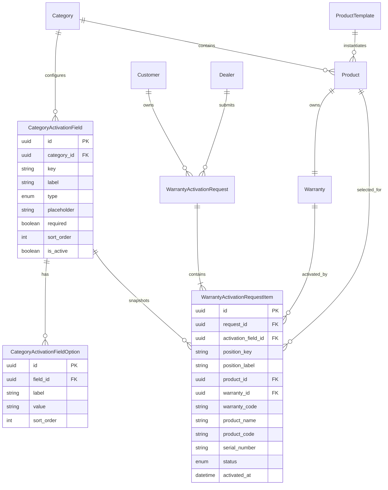
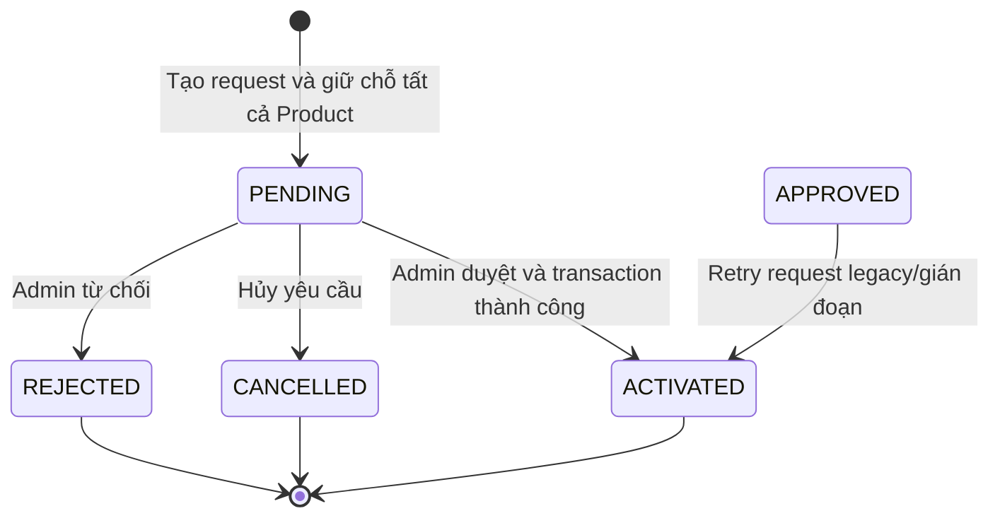
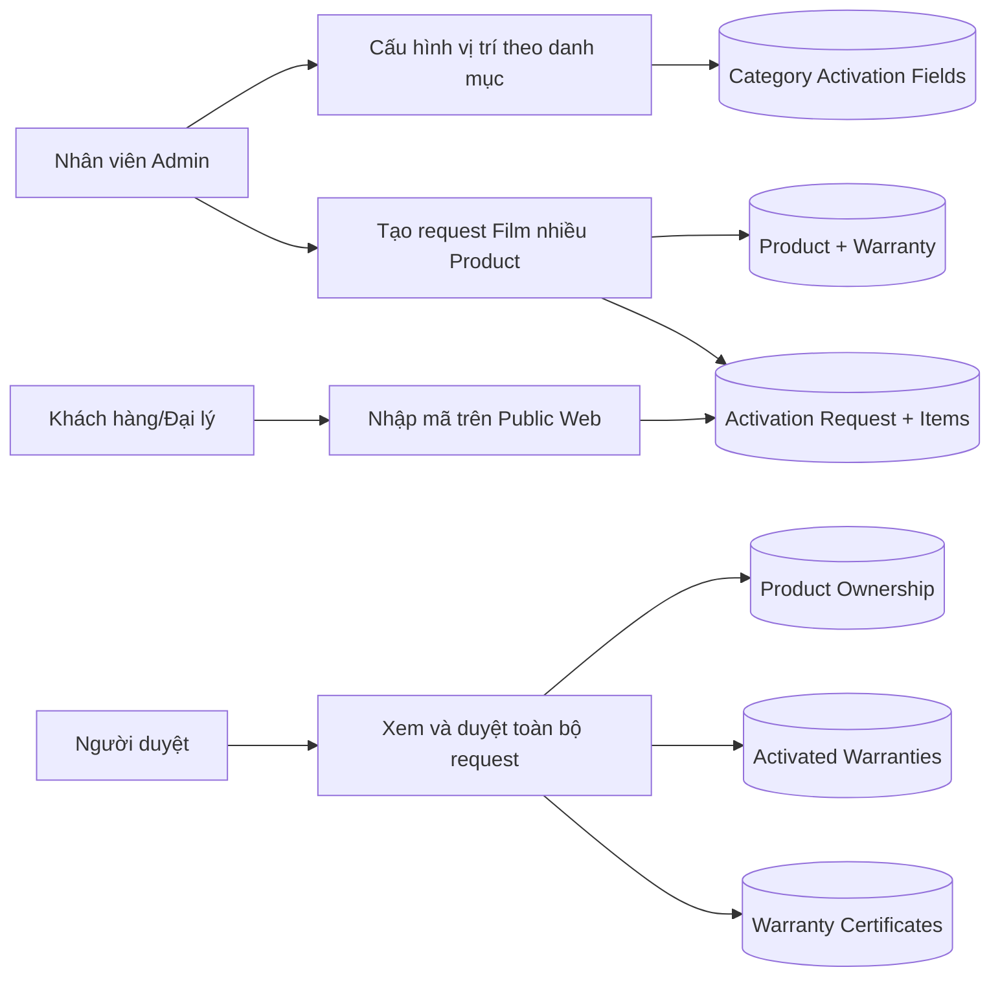
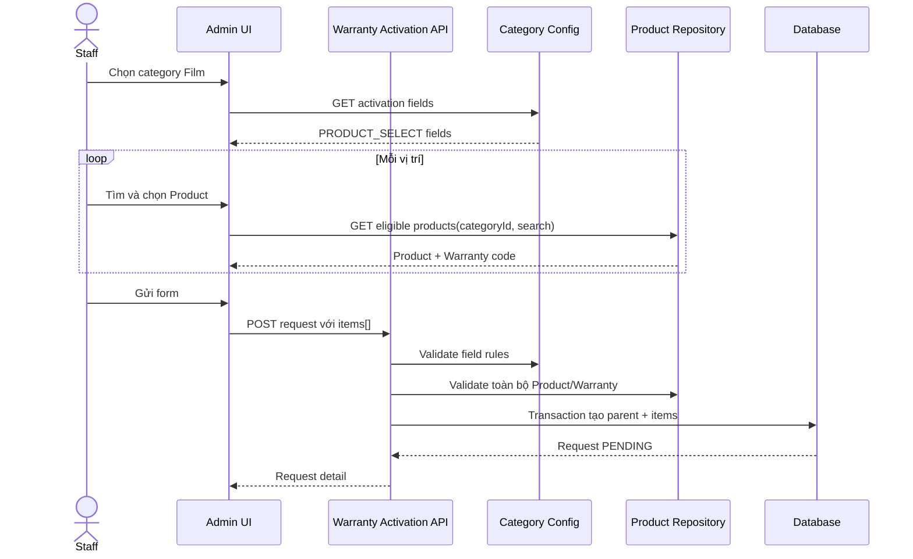
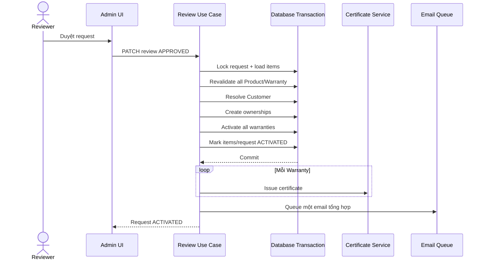

# Đặc tả và kế hoạch triển khai kích hoạt bảo hành nhiều sản phẩm

**Trạng thái:** Đã chốt thiết kế nghiệp vụ, sẵn sàng tách task triển khai  
**Ngày:** 2026-08-15  
**Phạm vi:** Admin, API, Shared contracts, Database; Public Web giữ nguyên trải nghiệm  
**Đối tượng chính:** Sản phẩm Film và các danh mục tương lai cần gắn nhiều sản phẩm vật lý cho một khách hàng/xe

## 1. Tóm tắt

Hệ thống hiện tại hỗ trợ cấu hình các trường kích hoạt theo danh mục, nhưng mỗi yêu cầu kích hoạt vẫn chỉ liên kết với một `Product` và một `Warranty`. Các lựa chọn như `SP50`, `RF35` trong các vị trí kính đang được nhập thủ công trong cấu hình và được lưu dưới dạng chuỗi; chúng không liên kết tới sản phẩm vật lý, serial hoặc mã bảo hành thực tế.

Tính năng mới chuyển sang mô hình:

```text
Một yêu cầu kích hoạt
  -> một khách hàng
  -> một xe
  -> một đại lý/nhân viên thi công
  -> nhiều vị trí lắp đặt
  -> mỗi vị trí liên kết một Product vật lý và Warranty riêng
```

Đối với Film, nhân viên chọn sản phẩm vật lý trực tiếp từ kho Product tại từng vị trí kính. Danh sách sản phẩm không còn được nhập tay trong cấu hình form. Cấu hình danh mục chỉ định nghĩa cấu trúc form và quy tắc bắt buộc.

Public Web tiếp tục flow một mã kích hoạt tương ứng một sản phẩm. Nội bộ API chuẩn hóa cả Public và Admin về cùng một mô hình item: Public tạo một item, Admin Film có thể tạo nhiều item.

## 2. Bối cảnh hiện tại

### 2.1. Cấu hình form danh mục

Các field hiện được lưu trong `Category.metadata.activationFields` và hỗ trợ:

- `TEXT`
- `TEXTAREA`
- `NUMBER`
- `DATE`
- `SELECT`

`SELECT` sử dụng danh sách `label/value` nhập tay. Ví dụ, Admin phải tự khai báo `SP50`, `SP10`, `B55` cho từng vị trí.

Nếu danh mục chưa có cấu hình, Admin hiện dùng `DEFAULT_CATEGORY_ACTIVATION_FIELDS`, trong đó bảy vị trí Film được hardcode tại runtime.

### 2.2. Tạo yêu cầu kích hoạt

Form Admin hiện yêu cầu:

- Một `categoryId`.
- Một `productId` bắt buộc từ ô tìm sản phẩm chung.
- Các giá trị bổ sung trong `categoryInputValues`.
- Các vị trí Film được chuyển thành `filmItems` dạng chuỗi trong metadata.

Contract và database hiện chỉ biểu diễn một sản phẩm chính:

```text
WarrantyActivationRequest.product_id
WarrantyActivationRequest.warranty_code
WarrantyActivationRequest.activated_warranty_id
```

### 2.3. Duyệt yêu cầu

Khi Admin duyệt, backend:

1. Tìm một Product bằng `warranty_code`.
2. Kiểm tra Warranty đang `DRAFT`.
3. Gán Product cho Customer.
4. Kích hoạt một Warranty.
5. Gắn một `activated_warranty_id` vào request.
6. Sinh một chứng nhận bảo hành.

### 2.4. Khoảng cách so với yêu cầu mới

Hệ thống hiện có thể hiển thị nhiều ô Film nhưng không thể:

- Liên kết mỗi ô với một Product vật lý.
- Kiểm tra Product/Warranty của từng vị trí.
- Ngăn một Product được dùng ở nhiều vị trí/yêu cầu đang mở.
- Kích hoạt nhiều Warranty trong một lần duyệt.
- Hiển thị hoặc export danh sách sản phẩm theo vị trí.
- Sinh và quản lý nhiều chứng nhận từ cùng một request.

## 3. Goal

Cho phép một yêu cầu kích hoạt bảo hành chứa nhiều sản phẩm vật lý, trong đó mỗi sản phẩm:

- Có `productId` riêng.
- Có serial/product code riêng nếu được khai báo.
- Có Warranty và mã bảo hành riêng.
- Được gắn vào một vị trí cấu hình của danh mục.
- Được kiểm tra, giữ chỗ và kích hoạt cùng các item khác trong một transaction.

Thành công khi nhân viên có thể nhập thông tin khách hàng/xe một lần, chọn nhiều sản phẩm Film theo từng vị trí và duyệt toàn bộ bằng một yêu cầu duy nhất.

## 4. Non-goals

Không triển khai trong phạm vi này:

- Tạo Product hoặc Product Template ngay trong form kích hoạt.
- Sinh hàng loạt mã kích hoạt 50-1000 mã.
- Báo cáo khách hàng theo đại lý hoặc drill-down từ đại lý.
- Duyệt/từ chối riêng từng item.
- Cho phép một item chứa nhiều Product.
- Thay đổi cách tính thời hạn bảo hành theo từng vị trí.
- Thay đổi giao diện Public Web ngoài các điều chỉnh contract nội bộ cần thiết.
- Xóa ngay các cột legacy trên `WarrantyActivationRequest`.

## 5. Thuật ngữ domain

| Thuật ngữ               | Ý nghĩa                                                                         |
| ----------------------- | ------------------------------------------------------------------------------- |
| Product Template        | Mẫu/dòng sản phẩm dùng chung, ví dụ SP50. Không đại diện cho một đơn vị vật lý. |
| Product                 | Một sản phẩm vật lý có `productId`, product code, serial và lifecycle riêng.    |
| Warranty                | Bảo hành thuộc duy nhất một Product, có mã và trạng thái riêng.                 |
| Activation Field        | Cấu hình một trường/vị trí trong form kích hoạt của danh mục.                   |
| Product Selector Field  | Activation Field loại `PRODUCT_SELECT`, lấy Product thực tế từ backend.         |
| Activation Request      | Yêu cầu cha chứa thông tin khách hàng, xe, đại lý và trạng thái xét duyệt.      |
| Activation Request Item | Dòng con liên kết một vị trí với một Product và Warranty.                       |
| Open Request            | Request ở trạng thái `PENDING` hoặc `APPROVED`.                                 |

## 6. Phạm vi chức năng

### 6.1. Trong phạm vi

- Cấu hình Activation Field bằng dữ liệu first-class thay cho JSON metadata.
- Bổ sung loại field `PRODUCT_SELECT`.
- Loại bỏ fallback hardcode `DEFAULT_CATEGORY_ACTIVATION_FIELDS` khỏi runtime.
- Migration cấu hình hiện có từ metadata sang bảng cấu hình.
- Chọn Product thực tế theo từng vị trí trong Admin.
- Một Activation Request có một hoặc nhiều item.
- Public request được chuẩn hóa thành một item.
- Validation eligibility cho toàn bộ Product trước khi tạo và trước khi duyệt.
- Kích hoạt nhiều Warranty nguyên tử.
- Gán nhiều Product cho cùng Customer.
- Hiển thị item trong danh sách/chi tiết Admin.
- Export item theo request.
- Sinh chứng nhận riêng cho từng Warranty và gửi email tổng hợp.
- Tương thích đọc dữ liệu request cũ.

### 6.2. Ngoài phạm vi

Áp dụng danh sách tại mục Non-goals.

## 7. Quyết định kiến trúc

### 7.1. Một request cha và nhiều item con

Chọn mô hình một `WarrantyActivationRequest` có nhiều `WarrantyActivationRequestItem` thay vì:

- Tạo nhiều request đơn rồi nhóm bằng batch ID.
- Lưu danh sách `productId` trong metadata.

Lý do:

- Phản ánh đúng nghiệp vụ một lần nhập, một lần duyệt.
- Có khóa ngoại và tính toàn vẹn tham chiếu.
- Truy vấn, báo cáo, chống trùng và audit rõ ràng.
- Có thể mở rộng cho danh mục khác mà không hardcode Film.
- Phù hợp nguyên tắc trong `CONTEXT.md`: dữ liệu chi phối business logic không đặt trong metadata.

### 7.2. Cấu hình field là first-class data

Activation Field quyết định:

- Vị trí nào tồn tại.
- Vị trí nào bắt buộc.
- Giá trị nào là Product thực tế.
- Payload nào hợp lệ.

Vì vậy cấu hình được chuyển từ `Category.metadata.activationFields` sang bảng riêng. Metadata cũ chỉ được dùng làm nguồn migration, không tiếp tục là source of truth.

### 7.3. Cùng một item model cho Public và Admin

- Public Web tạo đúng một item có `positionKey = "primaryProduct"`.
- Admin multi-product tạo một item cho mỗi `PRODUCT_SELECT` đã chọn.
- Admin single-product cũng tạo một item `primaryProduct`.

Điều này tránh duy trì hai lifecycle kích hoạt khác nhau.

### 7.4. Tương thích ngược bằng dual-read/dual-write có thời hạn

Trong giai đoạn chuyển đổi:

- `items[]` là source of truth mới.
- Các cột singular trên request vẫn được ghi bằng item đầu tiên để client cũ không lỗi.
- Response vẫn trả các field singular và bổ sung `items[]`.
- Logic review và eligibility chỉ sử dụng item table sau khi backfill hoàn tất.
- Việc xóa cột legacy là một migration riêng ngoài phạm vi tài liệu này.

## 8. Domain model

### 8.1. Sơ đồ quan hệ



### 8.2. Category

Bổ sung:

```text
activation_form_enabled Boolean @default(false)
activation_fields       CategoryActivationField[]
```

`activation_form_enabled` thay thế `metadata.activationFieldsEnabled` làm source of truth.

### 8.3. CategoryActivationField

Trường đề xuất:

| Field         | Kiểu     | Rule                                                             |
| ------------- | -------- | ---------------------------------------------------------------- |
| `id`          | UUID     | Primary key                                                      |
| `category_id` | UUID     | Bắt buộc, FK Category                                            |
| `key`         | String   | Bắt buộc, duy nhất trong category                                |
| `label`       | String   | Bắt buộc                                                         |
| `type`        | Enum     | `TEXT`, `TEXTAREA`, `NUMBER`, `DATE`, `SELECT`, `PRODUCT_SELECT` |
| `placeholder` | String?  | Tùy chọn                                                         |
| `required`    | Boolean  | Mặc định `false`                                                 |
| `sort_order`  | Int      | Mặc định `0`                                                     |
| `is_active`   | Boolean  | Mặc định `true`                                                  |
| `created_at`  | DateTime | Audit                                                            |
| `updated_at`  | DateTime | Audit                                                            |

Constraint:

```text
UNIQUE(category_id, key)
INDEX(category_id, is_active, sort_order)
```

### 8.4. CategoryActivationFieldOption

Chỉ dùng cho field `SELECT`. `PRODUCT_SELECT` không có option tĩnh.

Constraint:

```text
UNIQUE(field_id, value)
INDEX(field_id, sort_order)
```

### 8.5. WarrantyActivationRequestItem

Trường đề xuất:

| Field                 | Kiểu                | Rule                                                        |
| --------------------- | ------------------- | ----------------------------------------------------------- |
| `id`                  | UUID                | Primary key                                                 |
| `request_id`          | UUID                | FK request, cascade khi xóa request                         |
| `activation_field_id` | UUID?               | Nullable cho request cũ/Public; `SET NULL` khi field bị xóa |
| `position_key`        | String              | Snapshot key, Public dùng `primaryProduct`                  |
| `position_label`      | String              | Snapshot label                                              |
| `product_id`          | UUID                | FK Product, bắt buộc                                        |
| `warranty_id`         | UUID                | FK Warranty, bắt buộc                                       |
| `warranty_code`       | String              | Snapshot mã bảo hành                                        |
| `product_name`        | String              | Snapshot tên hiển thị                                       |
| `product_code`        | String              | Snapshot product code                                       |
| `serial_number`       | String?             | Snapshot serial                                             |
| `status`              | Enum request status | Đồng bộ lifecycle với request                               |
| `activated_at`        | DateTime?           | Thời điểm kích hoạt thành công                              |
| `created_at`          | DateTime            | Audit                                                       |
| `updated_at`          | DateTime            | Audit                                                       |

Constraint:

```text
UNIQUE(request_id, position_key)
UNIQUE(request_id, product_id)
INDEX(request_id, status)
INDEX(product_id, status)
INDEX(warranty_id)
```

Database migration tạo partial unique index:

```sql
CREATE UNIQUE INDEX warranty_activation_request_item_one_open_per_product
ON warranty_activation_request_item (product_id)
WHERE status IN ('PENDING', 'APPROVED');
```

Item lưu snapshot để việc đổi tên Product hoặc đổi label cấu hình không làm thay đổi lịch sử request.

## 9. API contracts

### 9.1. Activation field contracts

Thêm `PRODUCT_SELECT` vào `CATEGORY_ACTIVATION_FIELD_TYPES`.

```ts
type CategoryActivationFieldType =
  | "TEXT"
  | "TEXTAREA"
  | "NUMBER"
  | "DATE"
  | "SELECT"
  | "PRODUCT_SELECT";
```

Response category detail bổ sung:

```ts
type CategoryResponse = {
  // Existing fields
  activationFormEnabled: boolean;
  activationFields: CategoryActivationFieldConfig[];
};
```

API cấu hình:

```http
GET /categories/:categoryId/activation-fields
PUT /categories/:categoryId/activation-fields
```

`PUT` thay thế toàn bộ cấu hình trong một transaction để giữ thứ tự, key uniqueness và option consistency.

### 9.2. Eligible products

Mở rộng `GET /products` với:

```http
GET /products?categoryId=:id&activationEligible=true&search=:keyword
```

Khi `activationEligible=true`, backend chỉ trả Product thỏa toàn bộ rule eligibility. Không chỉ lọc ở frontend.

Response tiếp tục dùng `ProductResponse`; các trường cần hiển thị gồm:

- `id`
- `name/displayName`
- `productCode`
- `serialNumber`
- `warrantyCode`
- `warranty.status`
- `categoryId`

### 9.3. Create Admin request

Contract mới:

```ts
type CreateWarrantyActivationRequestItemBody = {
  activationFieldId?: string;
  positionKey: string;
  productId: string;
};

type CreateAdminWarrantyActivationRequestBody = {
  categoryId: string;
  items: CreateWarrantyActivationRequestItemBody[];
  customerName: string;
  customerPhone: string;
  customerEmail?: string;
  customerBirthdate?: string;
  vehiclePlate?: string;
  vehicleModel?: string;
  dealerId?: string;
  provinceCode: string;
  provinceName: string;
  wardCode: string;
  wardName: string;
  addressDetail: string;
  note?: string;
  metadata?: Record<string, unknown>;
};
```

Client không được gửi `warrantyId`, `warrantyCode`, tên hoặc serial làm source of truth. Backend resolve các giá trị đó từ `productId` và lưu snapshot.

### 9.4. Public request

Public contract vẫn nhận `warrantyCode`. Backend resolve Product và tạo:

```ts
{
  positionKey: "primaryProduct",
  productId: resolvedProduct.id
}
```

Public Web không cần biết về `items[]` khi submit.

### 9.5. Response

`WarrantyActivationRequestSummary` bổ sung:

```ts
type WarrantyActivationRequestItemSummary = {
  id: string;
  activationFieldId: string | null;
  positionKey: string;
  positionLabel: string;
  productId: string;
  productName: string;
  productCode: string;
  serialNumber: string | null;
  warrantyId: string;
  warrantyCode: string;
  warrantyStatus: WarrantyStatus;
  status: WarrantyActivationRequestStatus;
  activatedAt: string | null;
  certificate: WarrantyCertificateSummary | null;
};
```

Request response thêm:

```ts
items: WarrantyActivationRequestItemSummary[];
itemCount: number;
```

Các field singular hiện tại tiếp tục mirror item đầu tiên trong giai đoạn tương thích.

## 10. Lifecycle

### 10.1. State diagram



Trong v1 không có trạng thái item độc lập với parent. Item status luôn được cập nhật cùng parent trong transaction.

### 10.2. Tạo request

1. Đọc cấu hình category từ database.
2. Xác nhận category active và activation form enabled.
3. Validate required fields và unique `positionKey`.
4. Resolve toàn bộ Product theo `productId` bằng một query/batch query.
5. Validate category, status, Warranty, warranty code và open request.
6. Xác nhận không trùng `productId` trong payload.
7. Tạo request và items trong một transaction.
8. Mirror item đầu tiên vào các cột singular legacy.
9. Gửi một thông báo request-created.

Nếu một item không hợp lệ, không tạo request.

### 10.3. Duyệt request

1. Lock/đọc lại request và toàn bộ items trong transaction.
2. Xác nhận request ở trạng thái có thể duyệt.
3. Revalidate tất cả Product và Warranty.
4. Resolve hoặc tạo Customer một lần.
5. Kết thúc owner hiện tại của từng Product.
6. Tạo ownership mới cho cùng Customer.
7. Kích hoạt tất cả Warranty với cùng `reviewedAt` làm `startDate`.
8. Cập nhật tất cả item thành `ACTIVATED`.
9. Cập nhật parent thành `ACTIVATED`.
10. Mirror Warranty đầu tiên vào `activated_warranty_id` legacy.
11. Commit transaction.
12. Sinh chứng nhận cho từng Warranty sau transaction.
13. Gửi một email tổng hợp chứa nhiều chứng nhận/link.

Nếu bước 1-9 lỗi, rollback toàn bộ. Không được có trường hợp một phần Warranty đã active.

Lỗi sinh PDF/email sau transaction không rollback Warranty; trạng thái certificate ghi `FAILED` và có thể retry.

### 10.4. Từ chối hoặc hủy

- Parent và toàn bộ item chuyển cùng trạng thái.
- Warranty giữ `DRAFT`.
- Không tạo ProductOwnership mới.
- Partial unique index không còn coi Product là đang bị giữ chỗ.
- Product có thể được chọn cho request mới.

## 11. Business rules

### BR-01 — Sản phẩm vật lý

Mỗi `PRODUCT_SELECT` phải lưu một `productId` của Product vật lý; không chấp nhận Product Template ID hoặc text như `SP50` làm giá trị kích hoạt.

### BR-02 — Category match

Product phải thuộc chính category của request. Frontend filter để hỗ trợ UX; backend validate để bảo vệ dữ liệu.

### BR-03 — Product eligibility

Product hợp lệ khi:

- `Product.status = ACTIVE`.
- `Product.deleted_at IS NULL`.
- Có Warranty.
- `Warranty.status = DRAFT`.
- `Warranty.warranty_code IS NOT NULL`.
- Không thuộc open Activation Request khác.

### BR-04 — Required positions

Mọi Activation Field active, type `PRODUCT_SELECT`, `required = true` phải có đúng một item tương ứng.

### BR-05 — Unique position và Product

- Một `positionKey` xuất hiện tối đa một lần trong request.
- Một Product xuất hiện tối đa một lần trong request.
- Một Product xuất hiện tối đa trong một open request trên toàn hệ thống.

### BR-06 — Atomic approval

Request nhiều item được duyệt toàn bộ hoặc không item nào được kích hoạt.

### BR-07 — Ownership

Tất cả Product trong một request được gán cho cùng Customer được resolve từ thông tin parent request.

### BR-08 — Warranty dates

Giữ business logic hiện tại: `startDate` là thời điểm Admin duyệt; `endDate` do `WarrantyLifecycleService` tính theo `durationMonths` của từng Warranty.

### BR-09 — Configuration snapshot

Request item lưu `positionKey` và `positionLabel` snapshot. Đổi/xóa cấu hình sau này không thay đổi request lịch sử.

### BR-10 — Static SELECT

`SELECT` tiếp tục dùng option thủ công cho dữ liệu tĩnh. `PRODUCT_SELECT` luôn lấy Product từ API và không được có option thủ công.

### BR-11 — Category change

Khi đổi category trên form, toàn bộ item và category-specific input đã chọn phải được xóa sau khi người dùng xác nhận.

### BR-12 — Certificate

Mỗi Warranty có chứng nhận riêng. Một request nhiều item gửi một email tổng hợp sau khi các chứng nhận được tạo/xếp hàng.

## 12. Use cases

### UC-01 — Cấu hình vị trí Film

**Actor:** Admin có `CATEGORY_UPDATE`  
**Tiền điều kiện:** Category tồn tại  
**Luồng chính:**

1. Admin mở “Cấu hình form kích hoạt”.
2. Bật form kích hoạt.
3. Thêm/sửa field `Kính lái`, key `windshield`.
4. Chọn type `PRODUCT_SELECT`.
5. Đặt required, placeholder và thứ tự.
6. Lưu toàn bộ cấu hình.
7. Backend validate key uniqueness và lưu transaction.

**Kết quả:** Form Admin sử dụng cấu hình mới; không cần khai báo SP50/SP10 thủ công.

### UC-02 — Tạo yêu cầu Film nhiều sản phẩm

**Actor:** Admin/Moderator có quyền tạo activation request  
**Tiền điều kiện:** Category có field `PRODUCT_SELECT`; các Product đã có Warranty code  
**Luồng chính:**

1. Nhân viên chọn category Film.
2. Form tải Activation Fields.
3. Nhân viên tìm và chọn Product cho từng vị trí.
4. Form loại Product đã chọn khỏi các vị trí còn lại.
5. Nhân viên nhập khách hàng, xe, đại lý và địa chỉ.
6. Client submit `categoryId + items[] + customer/vehicle data`.
7. Backend validate tất cả item.
8. Backend tạo một request và nhiều item.

**Kết quả:** Request ở `PENDING`, toàn bộ Product được giữ khỏi request mở khác.

### UC-03 — Duyệt yêu cầu nhiều sản phẩm

**Actor:** Admin/Moderator có quyền review  
**Tiền điều kiện:** Request `PENDING`; tất cả Warranty còn `DRAFT`  
**Luồng chính:**

1. Reviewer mở chi tiết và xem danh sách vị trí/sản phẩm.
2. Reviewer chọn duyệt.
3. Backend revalidate và kích hoạt toàn bộ trong transaction.
4. Backend gán tất cả Product cho Customer.
5. Backend tạo chứng nhận cho từng Warranty.
6. Hệ thống gửi email tổng hợp.

**Kết quả:** Parent và items ở `ACTIVATED`.

### UC-04 — Public kích hoạt một sản phẩm

**Actor:** Khách hàng hoặc đại lý  
**Luồng:** Giữ nguyên UX nhập mã; backend tạo request với một item `primaryProduct`.

### UC-05 — Product hết hợp lệ trước khi duyệt

**Actor:** Reviewer  
**Luồng ngoại lệ:** Một Warranty đã không còn `DRAFT` hoặc Product không còn active. Backend từ chối toàn bộ thao tác, trả lỗi chứa `productId`, `positionKey` và mã lỗi có thể dịch. Không Product nào bị kích hoạt.

## 13. Sơ đồ use case và sequence

### 13.1. Use-case overview



### 13.2. Sequence tạo request Admin



### 13.3. Sequence duyệt request



## 14. UX changes

### 14.1. Màn cấu hình form kích hoạt

- Thêm option “Chọn sản phẩm thực tế” tương ứng `PRODUCT_SELECT`.
- Khi type là `PRODUCT_SELECT`, ẩn “Danh sách lựa chọn”.
- Hiển thị helper: “Danh sách được lấy từ các sản phẩm đủ điều kiện thuộc danh mục này.”
- `SELECT` vẫn hiển thị editor label/value hiện tại.
- Không tự nạp bảy field Film khi category chưa cấu hình.
- Nút lưu gọi endpoint activation-fields riêng thay vì patch toàn bộ metadata.

### 14.2. Màn tạo request Admin

- Category luôn được chọn trước.
- Nếu category có `PRODUCT_SELECT`, bỏ ô product search chung.
- Mỗi vị trí hiển thị searchable Product selector.
- Option hiển thị tên, product code, serial, warranty code.
- Product đã chọn ở vị trí khác vẫn có thể nhìn thấy nhưng disabled để giải thích lý do.
- Vị trí không bắt buộc có action xóa lựa chọn.
- Hiển thị tổng số sản phẩm đã chọn trước nút submit.
- Khi đổi category có dữ liệu, hiển thị confirm rồi mới reset.
- Validation nằm ngay dưới vị trí tương ứng; root error chỉ dùng cho lỗi transaction/API.

### 14.3. Chi tiết và review

Hiển thị bảng:

| Vị trí | Sản phẩm | Product code/Serial | Mã bảo hành | Trạng thái | Chứng nhận |
| ------ | -------- | ------------------- | ----------- | ---------- | ---------- |

Dialog duyệt hiển thị số lượng sản phẩm và cảnh báo toàn bộ sẽ được kích hoạt cùng lúc.

### 14.4. Danh sách và export

- Danh sách hiển thị `N sản phẩm`; với một item vẫn hiển thị tên sản phẩm như hiện tại.
- Search mở rộng qua item product name, product code, serial và warranty code.
- Filter warranty code tìm trong item table.
- Export giữ một dòng/request, thêm:
  - `Số sản phẩm`.
  - `Sản phẩm theo vị trí` dạng `Kính lái: WM-...; Kính lưng: WM-...`.

### 14.5. Public Web

Không thay đổi bố cục hoặc thao tác người dùng. Regression test bảo đảm mã bảo hành vẫn resolve đúng một Product và tạo một item.

## 15. Error model

Bổ sung mã lỗi có cấu trúc trong `details.code`:

| Code                                     | Khi xảy ra                                   |
| ---------------------------------------- | -------------------------------------------- |
| `ACTIVATION_ITEMS_REQUIRED`              | Request không có item                        |
| `ACTIVATION_FIELD_REQUIRED`              | Thiếu vị trí bắt buộc                        |
| `ACTIVATION_FIELD_NOT_FOUND`             | Field không thuộc category hoặc đã inactive  |
| `ACTIVATION_POSITION_DUPLICATED`         | Trùng position key                           |
| `ACTIVATION_PRODUCT_DUPLICATED`          | Trùng Product trong request                  |
| `ACTIVATION_PRODUCT_NOT_ELIGIBLE`        | Product/Warranty không đủ điều kiện          |
| `ACTIVATION_PRODUCT_ALREADY_RESERVED`    | Product thuộc open request khác              |
| `ACTIVATION_PRODUCT_CATEGORY_MISMATCH`   | Product khác category                        |
| `ACTIVATION_MULTI_ITEM_APPROVAL_FAILED`  | Transaction duyệt thất bại                   |
| `ACTIVATION_CERTIFICATE_PARTIAL_FAILURE` | Warranty active nhưng một số certificate lỗi |

Admin thêm i18n `vi/en` cho tất cả code. Nếu BE trả code chưa có bản dịch, helper dùng message tiếng Anh từ BE theo quy ước hiện tại.

## 16. Dependency và module impact

### 16.1. Database/Prisma

**Sửa:**

- `apps/api/prisma/schema.prisma`
- `apps/api/prisma/seed.ts`
- `apps/api/prisma/seed-categories.ts`

**Tạo:**

- `apps/api/prisma/migrations/20260815090000_add_category_activation_fields_and_request_items/migration.sql`

**Lý do:** Cần first-class configuration, request-item relations, snapshots và unique reservation.

**Ảnh hưởng business logic:** Có. Source of truth chuyển từ request singular/metadata sang item rows.

### 16.2. Shared contracts

**Sửa:**

- `packages/shared/src/types/category-activation-field.types.ts`
- `packages/shared/src/types/category.types.ts`
- `packages/shared/src/types/warranty-activation-request.types.ts`
- `packages/shared/src/types/index.ts`

**Lý do:** Admin/API/Web phải dùng cùng field type và request item contract.

**Ảnh hưởng business logic:** Có ở contract; giữ field legacy để không phá consumer cũ.

### 16.3. Categories API

**Sửa:**

- `apps/api/src/modules/categories/categories.module.ts`
- `apps/api/src/modules/categories/categories.controller.ts`
- `apps/api/src/modules/categories/categories.types.ts`
- `apps/api/src/modules/categories/repository/categories.repository.ts`
- `apps/api/src/modules/categories/use-cases/get-category-detail.use-case.ts`
- `apps/api/src/modules/categories/tests/categories.use-cases.spec.ts`

**Tạo:**

- `apps/api/src/modules/categories/dto/update-category-activation-fields.dto.ts`
- `apps/api/src/modules/categories/use-cases/get-category-activation-fields.use-case.ts`
- `apps/api/src/modules/categories/use-cases/update-category-activation-fields.use-case.ts`
- `apps/api/src/modules/categories/tests/category-activation-fields.use-case.spec.ts`

**Lý do:** Cấu hình cần API riêng, validation server-side và transaction thay thế toàn bộ.

**Ảnh hưởng business logic:** Có; field required và type trở thành rule backend.

### 16.4. Products API

**Sửa:**

- `apps/api/src/modules/products/dto/list-products.dto.ts`
- `apps/api/src/modules/products/repository/products.repository.ts`
- `apps/api/src/modules/products/use-cases/list-products.use-case.ts`
- `apps/api/src/modules/products/tests/products.repository.spec.ts`

**Lý do:** Cần query Product đủ điều kiện theo category và loại trừ open request.

**Ảnh hưởng business logic:** Không thay đổi lifecycle Product; chỉ bổ sung projection/filter eligibility dùng chung.

### 16.5. Warranty Activation Requests API

**Sửa:**

- `apps/api/src/modules/warranty-activation-requests/dto/create-warranty-activation-request.dto.ts`
- `apps/api/src/modules/warranty-activation-requests/dto/create-admin-warranty-activation-request.dto.ts`
- `apps/api/src/modules/warranty-activation-requests/use-cases/create-warranty-activation-request.use-case.ts`
- `apps/api/src/modules/warranty-activation-requests/use-cases/create-admin-warranty-activation-request.use-case.ts`
- `apps/api/src/modules/warranty-activation-requests/use-cases/review-warranty-activation-request.use-case.ts`
- `apps/api/src/modules/warranty-activation-requests/repository/warranty-activation-requests.repository.ts`
- `apps/api/src/modules/warranty-activation-requests/mappers/warranty-activation-request.mapper.ts`
- `apps/api/src/modules/warranty-activation-requests/excel/*`
- `apps/api/src/modules/warranty-activation-requests/tests/*.spec.ts`

**Tạo:**

- `apps/api/src/modules/warranty-activation-requests/warranty-activation-request-item.types.ts`
- `apps/api/src/modules/warranty-activation-requests/service/warranty-activation-item-validator.service.ts`
- `apps/api/src/modules/warranty-activation-requests/tests/warranty-activation-item-validator.service.spec.ts`

**Lý do:** Tạo, giữ chỗ, duyệt, map, search và export nhiều item.

**Ảnh hưởng business logic:** Lớn. Review chuyển từ kích hoạt một Warranty sang kích hoạt nhiều Warranty nguyên tử.

### 16.6. Warranty Certificates

**Sửa:**

- `apps/api/src/modules/warranty-certificates/warranty-certificates.module.ts`
- `apps/api/src/modules/warranty-certificates/use-cases/issue-warranty-certificate.use-case.ts`
- `apps/api/src/modules/warranty-certificates/services/warranty-certificate-email-queue.service.ts`
- `apps/api/src/modules/warranty-certificates/services/warranty-certificate-email-content.service.ts`
- Các test tương ứng.

**Tạo:**

- `apps/api/src/modules/warranty-certificates/use-cases/issue-warranty-certificates-for-request.use-case.ts`
- `apps/api/src/modules/warranty-certificates/services/warranty-certificate-batch-email.service.ts`

**Lý do:** Một request có nhiều Warranty/certificate nhưng chỉ nên gửi một email tổng hợp.

**Ảnh hưởng business logic:** Có ở orchestration email; lifecycle của từng certificate không đổi.

### 16.7. Admin category configuration

**Sửa:**

- `apps/admin/src/views/categories/category-activation-fields.view.tsx`
- `apps/admin/src/views/categories/hooks/use-categories.ts`
- `apps/admin/src/services/categories/create-categories.service.ts`
- `apps/admin/src/utils/category-activation-fields.ts`
- `apps/admin/src/utils/category-activation-fields.test.ts`
- `apps/admin/src/messages/vi.json`
- `apps/admin/src/messages/en.json`

**Tạo:**

- `apps/admin/src/views/categories/category-activation-fields.types.ts`
- `apps/admin/src/views/categories/category-activation-fields.utils.ts`
- Test cho view utils/service contract.

**Lý do:** Thêm `PRODUCT_SELECT`, bỏ editor option tĩnh đối với loại này và bỏ hardcoded fallback.

**Ảnh hưởng business logic:** UI phản ánh rule từ backend; không tự quyết định eligibility.

### 16.8. Admin create/review/list/detail

**Sửa:**

- `apps/admin/src/views/warranty-activation-requests/warranty-activation-requests.types.ts`
- `apps/admin/src/views/warranty-activation-requests/warranty-activation-requests.utils.ts`
- `apps/admin/src/views/warranty-activation-requests/hooks/use-create-warranty-activation-request-form.ts`
- `apps/admin/src/views/warranty-activation-requests/components/create-warranty-activation-request-form-card.tsx`
- `apps/admin/src/views/warranty-activation-requests/components/category-activation-input-fields.tsx`
- `apps/admin/src/views/warranty-activation-requests/components/warranty-activation-request-detail-card.tsx`
- `apps/admin/src/views/warranty-activation-requests/components/review-warranty-activation-request-dialog.tsx`
- `apps/admin/src/views/warranty-activation-requests/components/warranty-activation-requests-table.tsx`
- `apps/admin/src/services/warranty-activation-requests/create-warranty-activation-requests.service.ts`
- `apps/admin/src/messages/vi.json`
- `apps/admin/src/messages/en.json`

**Tạo:**

- `apps/admin/src/views/warranty-activation-requests/components/activation-product-select-field.tsx`
- `apps/admin/src/views/warranty-activation-requests/components/activation-request-items-table.tsx`
- `apps/admin/src/views/warranty-activation-requests/warranty-activation-request-items.utils.ts`
- Test cho payload mapping, duplicate prevention và category reset.

**Lý do:** Form cần field array sản phẩm, detail/review/list phải bỏ giả định singular.

**Ảnh hưởng business logic:** FE payload thay đổi; quyết định cuối cùng vẫn do BE validate.

### 16.9. Public Web

**Sửa tối thiểu:**

- `apps/web/src/views/warranty/warranty-activation.utils.ts`
- `apps/web/src/views/warranty/components/warranty-activation-request-form.tsx`
- Test activation hiện có.

**Lý do:** Đảm bảo contract tương thích; trải nghiệm người dùng không thay đổi.

**Ảnh hưởng business logic:** Không; backend tự tạo item `primaryProduct`.

## 17. Migration và rollout

### Phase 1 — Expand schema

1. Thêm bảng category field, option và request item.
2. Thêm `Category.activation_form_enabled`.
3. Copy `metadata.activationFieldsEnabled` và `metadata.activationFields` sang bảng mới.
4. Backfill mỗi request có `product_id` thành một item `primaryProduct`.
5. Copy status, Warranty, warranty code và snapshot từ dữ liệu hiện có.
6. Tạo constraints và partial unique index sau khi kiểm tra duplicate.
7. Giữ nguyên cột/index legacy trên request.

### Phase 2 — API dual-read/dual-write

1. API response ưu tiên items, fallback singular nếu request chưa có item.
2. Mọi request mới luôn tạo item.
3. Public tạo một item.
4. Admin single/multi tạo một hoặc nhiều item.
5. Mirror item đầu tiên vào singular fields.

### Phase 3 — Category config cutover

1. Admin đọc/ghi endpoint activation-fields mới.
2. Field Film được chuyển sang `PRODUCT_SELECT` bằng migration dữ liệu theo category code, không dùng UUID hardcode.
3. Xóa các option SP50/SP10/B55 khỏi field Product selector.
4. Bỏ runtime fallback `DEFAULT_CATEGORY_ACTIVATION_FIELDS`.

### Phase 4 — Admin multi-product UX

1. Render Product selector theo field.
2. Submit `items[]`.
3. Cập nhật list/detail/review/export.
4. Bổ sung i18n và validation.

### Phase 5 — Multi-warranty approval và certificate

1. Chuyển review sang transaction nhiều item.
2. Sinh certificate theo Warranty.
3. Gửi email tổng hợp.
4. Bổ sung retry certificate theo item.

### Phase 6 — Stabilize

1. Chạy backfill audit: request count, item count, duplicate open Product.
2. Theo dõi lỗi eligibility và certificate.
3. Xác nhận không còn consumer phụ thuộc singular fields trước khi lập kế hoạch cleanup riêng.

## 18. Kế hoạch triển khai theo task

### Task 1 — Shared contracts và schema mở rộng

- [ ] Viết test contract cho `PRODUCT_SELECT`, activation field response và request items.
- [ ] Thêm Prisma models/enums/relations.
- [ ] Viết migration expand + backfill có guard duplicate.
- [ ] Chạy Prisma generate và API typecheck.
- [ ] Commit độc lập schema/contracts.

**Hoàn thành khi:** Dữ liệu cũ có một item tương ứng và contracts compile trên cả ba app.

### Task 2 — Category activation field API

- [ ] Viết failing tests cho get/replace config.
- [ ] Tạo DTO validate field key/type/options.
- [ ] Tạo repository transaction replace fields/options.
- [ ] Tạo get/update use cases và controller routes.
- [ ] Bảo vệ bằng quyền category view/update.
- [ ] Chạy test module categories.

**Hoàn thành khi:** API lưu first-class config và từ chối option trên `PRODUCT_SELECT`.

### Task 3 — Eligible Product query

- [ ] Viết repository tests cho category/status/warranty code/open request.
- [ ] Thêm `activationEligible` vào list DTO.
- [ ] Cập nhật query Products để loại Product không hợp lệ.
- [ ] Giữ pagination và search hiện tại.
- [ ] Chạy test products.

**Hoàn thành khi:** Product selector chỉ nhận được sản phẩm có thể tạo request.

### Task 4 — Request item creation

- [ ] Viết test validator cho required position, duplicate Product và category mismatch.
- [ ] Viết test Public tạo một item.
- [ ] Viết test Admin tạo nhiều item.
- [ ] Tạo item validator service.
- [ ] Chuyển create use cases sang transaction parent + items.
- [ ] Dual-write item đầu tiên vào singular fields.
- [ ] Cập nhật mapper và response contracts.
- [ ] Chạy warranty activation API tests.

**Hoàn thành khi:** Public và Admin đều tạo item; Admin tạo được nhiều Product trong một request.

### Task 5 — Atomic multi-item approval

- [ ] Viết test tất cả Warranty cùng được activate.
- [ ] Viết test một item invalid rollback toàn bộ.
- [ ] Viết test ownership cùng Customer.
- [ ] Viết test reject/cancel giải phóng reservation.
- [ ] Cập nhật repository transaction và review use case.
- [ ] Cập nhật item/parent status đồng bộ.
- [ ] Chạy lifecycle tests.

**Hoàn thành khi:** Không tồn tại trạng thái kích hoạt dở dang giữa các item.

### Task 6 — Certificates và email tổng hợp

- [ ] Viết test mỗi Warranty sinh một certificate.
- [ ] Viết test một email chứa toàn bộ certificate/link.
- [ ] Viết test certificate failure không rollback Warranty.
- [ ] Tạo batch issue/email orchestration.
- [ ] Cập nhật download/view/resend endpoint để nhận item ID.
- [ ] Chạy certificate và email queue tests.

**Hoàn thành khi:** Một request nhiều sản phẩm có đủ certificate nhưng khách hàng chỉ nhận một email tổng hợp.

### Task 7 — Admin category configuration UX

- [ ] Viết service/util tests cho config mới.
- [ ] Chuyển view sang endpoint activation-fields.
- [ ] Thêm `PRODUCT_SELECT` và helper text.
- [ ] Ẩn options editor với `PRODUCT_SELECT`.
- [ ] Bỏ `DEFAULT_CATEGORY_ACTIVATION_FIELDS` và fallback runtime.
- [ ] Thêm i18n vi/en.
- [ ] Chạy admin tests/typecheck/lint.

**Hoàn thành khi:** Admin chỉ cấu hình vị trí; không nhập SP50/SP10 thủ công.

### Task 8 — Admin create request UX

- [ ] Viết tests cho payload `items[]` và duplicate prevention.
- [ ] Tạo Product selector field dùng API eligibility.
- [ ] Bỏ global product search khi category có `PRODUCT_SELECT`.
- [ ] Quản lý field array theo position key.
- [ ] Confirm/reset khi đổi category.
- [ ] Hiển thị validation và selected-product summary.
- [ ] Thêm i18n vi/en.
- [ ] Chạy admin tests/typecheck/lint.

**Hoàn thành khi:** Nhân viên nhập thông tin một lần và chọn nhiều Product theo vị trí.

### Task 9 — Admin list/detail/review/export

- [ ] Viết mapper/search/export tests cho nhiều item.
- [ ] Cập nhật list để hiển thị item count.
- [ ] Cập nhật detail/review với bảng items.
- [ ] Cập nhật search/filter warranty code qua relation items.
- [ ] Cập nhật Excel mapper/schema.
- [ ] Thêm certificate action theo item.
- [ ] Chạy API/Admin tests.

**Hoàn thành khi:** Toàn bộ hành trình quản trị không còn giả định request chỉ có một Product.

### Task 10 — Public regression và rollout audit

- [ ] Cập nhật Public tests để xác nhận một mã tạo một item.
- [ ] Chạy migration trên bản sao dữ liệu production.
- [ ] Kiểm tra số request cũ và số item backfill.
- [ ] Kiểm tra không có duplicate Product trong open items.
- [ ] Chạy test/typecheck/lint/build toàn monorepo.
- [ ] Deploy theo thứ tự database -> API -> Admin/Web.

**Hoàn thành khi:** Public flow không đổi và dữ liệu production được migrate an toàn.

## 19. Test strategy

### Unit tests

- Field config validation.
- Product eligibility.
- Required/optional positions.
- Duplicate product/position.
- Payload mapping.
- Response mapper và legacy fallback.
- Certificate batch orchestration.

### Repository/integration tests

- Migration/backfill.
- Partial unique index cho open Product.
- Transaction create parent/items.
- Transaction activate all/rollback all.
- Search qua item relations.
- Export nhiều item.

### Frontend tests

- `PRODUCT_SELECT` không render static options editor.
- Category change reset có xác nhận.
- Product đã chọn bị disabled ở selector khác.
- Required product field hiện lỗi đúng vị trí.
- Submit đúng `items[]`.
- Single-product category giữ flow cũ.
- Public activation không đổi hành vi.

### Manual QA matrix

| Case                                     | Kỳ vọng                                                      |
| ---------------------------------------- | ------------------------------------------------------------ |
| Film, ba vị trí hợp lệ                   | Tạo một request, ba items                                    |
| Thiếu vị trí required                    | Không submit, lỗi tại field                                  |
| Chọn cùng Product hai vị trí             | Chặn ở UI và BE                                              |
| Product thuộc category khác              | BE từ chối                                                   |
| Warranty không có code                   | Không xuất hiện trong selector; BE từ chối nếu gọi trực tiếp |
| Product nằm trong open request           | Không thể chọn/tạo request mới                               |
| Một Warranty đổi trạng thái trước review | Rollback toàn bộ review                                      |
| Reject request                           | Product có thể dùng trong request mới                        |
| Public code hợp lệ                       | Một request, một item `primaryProduct`                       |
| Certificate thứ hai lỗi                  | Warranties vẫn active, certificate báo failed và retry được  |

### Lệnh kiểm tra

```bash
pnpm --filter @repo/shared build
pnpm --filter @repo/api test
pnpm --filter @repo/api check-types
pnpm --filter @repo/api lint:strict
pnpm --filter @repo/admin test
pnpm --filter @repo/admin check-types
pnpm --filter @repo/admin lint
pnpm --filter @repo/web test
pnpm --filter @repo/web check-types
pnpm --filter @repo/web lint
pnpm build
```

## 20. Acceptance criteria

- [ ] Không còn cần nhập tay danh sách SP50/SP10/B55 cho field sản phẩm.
- [ ] Bảy vị trí Film không còn hardcode runtime.
- [ ] Category config hỗ trợ `PRODUCT_SELECT` first-class.
- [ ] Mỗi selector lấy Product đủ điều kiện trực tiếp từ backend.
- [ ] Một request lưu được nhiều Product/Warranty theo vị trí.
- [ ] Một Product không thể nằm trong hai open request.
- [ ] Backend validate cấu hình và eligibility độc lập với frontend.
- [ ] Review kích hoạt toàn bộ item nguyên tử.
- [ ] Tất cả Product được gán cùng Customer.
- [ ] Mỗi Warranty có certificate riêng và một email tổng hợp.
- [ ] List/detail/search/export hỗ trợ nhiều item.
- [ ] Public flow vẫn một mã, một Product và không thay đổi UX.
- [ ] Request cũ đọc được sau migration.
- [ ] Shared/API/Admin/Web vượt qua test, typecheck, lint và build.

## 21. Rủi ro và biện pháp giảm thiểu

| Rủi ro                                    | Mức độ     | Giảm thiểu                                                                |
| ----------------------------------------- | ---------- | ------------------------------------------------------------------------- |
| Hai nhân viên chọn cùng Product đồng thời | Cao        | Partial unique index + transaction + mã lỗi conflict                      |
| Kích hoạt một phần khi một Warranty lỗi   | Cao        | Revalidate và activate tất cả trong một transaction                       |
| Request cũ mất liên kết                   | Cao        | Backfill có kiểm đếm, dual-read và giữ singular columns                   |
| Config bị đổi làm sai lịch sử             | Trung bình | Snapshot position key/label trong item                                    |
| Nhiều email certificate                   | Trung bình | Batch email một lần/request                                               |
| Query list/search chậm                    | Trung bình | Index product/status/request; paginate; kiểm tra explain plan             |
| Rolling deploy giữa schema và API         | Trung bình | Expand schema trước, dual-write API sau, UI cuối                          |
| Metadata cũ và bảng mới lệch nhau         | Thấp       | Cutover một chiều; bảng mới là source of truth; không dual-write metadata |

## 22. Kết luận

Thay đổi này là một mở rộng domain thực sự, không phải chỉ đổi `SELECT` thành dropdown API. Sau triển khai:

```text
Trước:
Category config chứa text SP50
Request -> một Product chính
Film positions -> chuỗi metadata

Sau:
Category config chỉ chứa vị trí/rule
Product selector -> Product vật lý đã có Warranty code
Request -> nhiều item
Mỗi item -> vị trí + Product + Warranty
Review -> kích hoạt nguyên tử toàn bộ Warranty
```

Kiến trúc này đáp ứng Film hiện tại và cho phép các danh mục nhiều sản phẩm trong tương lai sử dụng cùng cơ chế mà không thêm hardcode theo danh mục.
