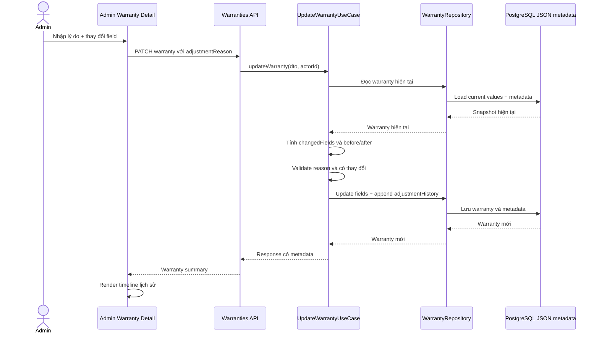

# Warranty Adjustment History Implementation Plan

> **For agentic workers:** Execute this plan task by task, verifying each task before moving to the next one.

**Goal:** Lưu lại toàn bộ lịch sử điều chỉnh bảo hành và hiển thị rõ lý do, người thực hiện, thời điểm cùng giá trị trước/sau trên trang chi tiết bảo hành.

**Architecture:** Tiếp tục dùng trường JSON `warranty.metadata`, nhưng chuyển từ một object `lastAdjustment` sang mảng `adjustmentHistory`. API tạo bản ghi lịch sử trong use case cập nhật bảo hành; Admin chỉ đọc và render timeline. Giữ `lastAdjustment` như dữ liệu tương thích tạm thời để không làm hỏng dữ liệu/consumer cũ.

**Tech Stack:** NestJS, Prisma JSON metadata, TypeScript, React/Next.js, existing Admin card components, existing i18n and date-format utilities.

## 1. Goal và phạm vi

### In scope

- Khi admin điều chỉnh bảo hành, append một entry mới vào `metadata.adjustmentHistory`.
- Lưu:
  - lý do điều chỉnh;
  - người thực hiện;
  - thời điểm thực hiện;
  - các field thay đổi;
  - giá trị trước và sau của từng field.
- Hiển thị lịch sử trên trang chi tiết bảo hành, bên dưới khu vực thông tin chính.
- Hỗ trợ dữ liệu cũ chỉ có `lastAdjustment`.
- Có trạng thái dữ liệu rỗng và dữ liệu metadata không hợp lệ mà không làm vỡ trang.
- Bổ sung test API và Admin.

### Out of scope

- Không tạo bảng audit riêng trong phase này.
- Không tạo endpoint mới.
- Không thay đổi quyền cập nhật bảo hành.
- Không thay đổi flow hủy bảo hành; `voidReason` vẫn hiển thị theo flow hiện tại.
- Không truy hồi giá trị trước đây cho các adjustment cũ nếu dữ liệu cũ chưa từng lưu before/after.

## 2. Dependency và module cần sửa

| Khu vực         | File/module dự kiến                                                                       | Vì sao cần sửa                                        | Ảnh hưởng business logic                                                               |
| --------------- | ----------------------------------------------------------------------------------------- | ----------------------------------------------------- | -------------------------------------------------------------------------------------- |
| Shared contract | `packages/shared/src/types/warranty.types.ts`                                             | Khai báo type cho adjustment history và change pair   | Không đổi API endpoint; làm response metadata có type rõ hơn                           |
| API use case    | `apps/api/src/modules/warranties/use-cases/update-warranty.use-case.ts`                   | Tính before/after và append entry thay vì overwrite   | Có thay đổi cách lưu metadata, nhưng không đổi điều kiện cập nhật hay giá trị warranty |
| API helper/type | `apps/api/src/modules/warranties/`                                                        | Parse metadata cũ, normalize giá trị nullable/decimal | Bảo toàn dữ liệu cũ và tránh lỗi khi metadata không đúng shape                         |
| API tests       | `apps/api/src/modules/warranties/tests/update-warranty.use-case.spec.ts`                  | Kiểm chứng append, before/after, nhiều lần điều chỉnh | Không ảnh hưởng production flow ngoài metadata audit                                   |
| Admin UI        | `apps/admin/src/views/warranties/components/warranty-adjustment-history.tsx`              | Component timeline hiển thị lịch sử                   | Chỉ thay đổi cách trình bày, không thay đổi thao tác cập nhật                          |
| Admin detail    | `apps/admin/src/views/warranties/components/warranty-detail-card.tsx` hoặc view tương ứng | Đặt history full-width dưới các card thông tin        | Không thay đổi dữ liệu                                                                 |
| Admin i18n      | `apps/admin/src/messages/vi.json`, `apps/admin/src/messages/en.json`                      | Nhãn lịch sử, lý do, actor, before/after, empty state | Không ảnh hưởng business logic                                                         |
| Admin tests     | `apps/admin/src/views/warranties/*history*.test.tsx` và test layout hiện có               | Kiểm chứng render dữ liệu mới/cũ và responsive        | Không ảnh hưởng runtime ngoài UI                                                       |

### Migration

Không cần migration Prisma trong phase này vì `warranty.metadata` đã là JSON và đang được dùng để lưu `lastAdjustment`. Chỉ thay đổi contract nội bộ của JSON.

Nếu sau này cần audit bất biến, tìm kiếm theo actor/thời gian hoặc báo cáo lớn, sẽ tách riêng bảng `warranty_adjustment_audits` ở phase khác.

## 3. Domain model

```ts
type WarrantyAdjustmentChange = {
  before: string | number | null;
  after: string | number | null;
};

type WarrantyAdjustmentHistoryEntry = {
  reason: string;
  changedFields: string[];
  changes: Record<string, WarrantyAdjustmentChange>;
  adjustedAt: string;
  adjustedByUserId: string | null;
};

type WarrantyAdjustmentMetadata = {
  adjustmentHistory?: WarrantyAdjustmentHistoryEntry[];

  // Compatibility mirror for existing consumers/data.
  lastAdjustment?: {
    reason: string;
    changedFields: string[];
    adjustedAt: string;
    adjustedByUserId: string | null;
  };
};
```

### Fields được theo dõi

Chỉ các field mutable của use case cập nhật bảo hành được đưa vào history:

- `durationMonths`;
- `coverageLimitAmount`;
- `maxAmountPerClaim`;
- `maxClaimCount`;
- `terms`.

Các field không thay đổi không được đưa vào `changedFields` hoặc `changes`.

Giá trị `Decimal`, `undefined`, chuỗi rỗng và `null` phải được normalize thống nhất trước khi so sánh để tránh tạo lịch sử giả do khác kiểu dữ liệu.

## 4. Lifecycle và business rules

1. Admin mở form điều chỉnh bảo hành.
2. Admin nhập lý do và thay đổi một hoặc nhiều field.
3. API đọc warranty hiện tại.
4. Use case tính danh sách thay đổi từ snapshot hiện tại và dữ liệu mới.
5. Nếu không có field thay đổi, giữ nguyên rule hiện tại và từ chối/không cập nhật.
6. Nếu lý do rỗng sau `trim`, giữ nguyên validation hiện tại.
7. Nếu hợp lệ:
   - cập nhật các field bảo hành;
   - append entry vào `metadata.adjustmentHistory`;
   - cập nhật `lastAdjustment` thành entry mới ở dạng compatibility mirror;
   - lưu trong cùng một repository update để tránh trạng thái nửa vời.
8. API trả về warranty mới cùng metadata.
9. Admin render entry mới nhất ở đầu timeline.

### Quy tắc tương thích dữ liệu cũ

- Nếu có `adjustmentHistory`, dùng mảng đó.
- Nếu chưa có mảng nhưng có `lastAdjustment`, chuyển dữ liệu đó thành một entry hiển thị được.
- Entry legacy không được tự bịa `before`/`after`; UI hiển thị “Không có dữ liệu trước đây” cho phần này.
- Nếu metadata là `null`, object sai shape hoặc history chứa item sai shape, bỏ qua item lỗi thay vì làm hỏng toàn bộ trang.
- Không giới hạn số entry trong phase đầu để không làm mất lịch sử. Nếu metadata tăng quá lớn, xử lý retention sẽ là quyết định riêng.

### Actor

Phase này giữ `adjustedByUserId` theo contract hiện tại. UI hiển thị ID hoặc fallback “Hệ thống”. Việc join sang tên/email user không nằm trong scope vì sẽ kéo theo thay đổi query/repository và response contract.

## 5. UX change

Trên trang chi tiết bảo hành, bên dưới các card hiện có, thêm một khu vực full-width:

- Tiêu đề: `Lịch sử điều chỉnh`.
- Mô tả ngắn: lịch sử các lần thay đổi thời hạn/điều kiện bảo hành.
- Timeline/card theo thứ tự mới nhất trước.
- Mỗi entry gồm:
  - lý do điều chỉnh;
  - thời điểm;
  - người thực hiện;
  - danh sách field đã đổi;
  - before → after.
- Dữ liệu dài phải wrap/truncate hợp lý, không làm vỡ layout desktop.
- Mobile chuyển thành một cột; before/after xếp dọc nếu không đủ chiều rộng.
- Không dùng màu đỏ cho toàn bộ card; chỉ dùng accent nhẹ để phân biệt lịch sử và trạng thái cảnh báo.
- Nếu chưa có lịch sử, hiển thị empty state nhẹ hoặc ẩn section theo convention của trang hiện tại.

### Mapping label

Không hiển thị raw key như `durationMonths` cho người dùng. Tạo translation mapping tập trung:

- `durationMonths` → Thời hạn bảo hành;
- `coverageLimitAmount` → Tổng hạn mức bảo hành;
- `maxClaimCount` → Số claim tối đa;
- `maxAmountPerClaim` → Hạn mức mỗi claim;
- `terms` → Điều khoản.

Giá trị tiền, số tháng và ngày dùng formatter hiện có của Admin; không tự nối chuỗi format ở component.

## 6. Use case / sequence



## 7. Implementation tasks

### Task 1: Chốt type và parser metadata

**Files:**

- `packages/shared/src/types/warranty.types.ts`;
- helper/type file trong `apps/api/src/modules/warranties/`;
- unit test cho parser nếu repo đã có pattern tương ứng.

**Steps:**

1. Thêm type cho change pair, history entry và metadata.
2. Viết parser/normalizer nhận `unknown`.
3. Hỗ trợ cả `adjustmentHistory` mới và `lastAdjustment` cũ.
4. Không throw khi metadata null hoặc malformed.

### Task 2: Append history trong update use case

**Files:**

- `apps/api/src/modules/warranties/use-cases/update-warranty.use-case.ts`;
- test use case hiện có.

**Steps:**

1. Tách snapshot field hiện tại thành hàm normalize có thể test độc lập.
2. Tính `changes` trước khi update.
3. Tạo entry mới với `adjustedAt`, actor, reason, changed fields.
4. Append vào history hiện có.
5. Giữ `lastAdjustment` mirror để tương thích.
6. Giữ nguyên transaction/repository abstraction hiện tại.

### Task 3: Test business rules API

**Cases:**

1. Lần đầu điều chỉnh tạo một history entry đầy đủ before/after.
2. Lần thứ hai giữ entry thứ nhất và append entry thứ hai.
3. Không thay đổi field thì không append entry.
4. Metadata chỉ có `lastAdjustment` vẫn được preserve và renderable.
5. Metadata null vẫn cập nhật được.
6. Decimal/null/empty terms được so sánh đúng.

### Task 4: Component lịch sử trên Admin

**Files:**

- `apps/admin/src/views/warranties/components/warranty-adjustment-history.tsx`;
- `apps/admin/src/views/warranties/components/warranty-detail-card.tsx` hoặc view detail tương ứng.

**Steps:**

1. Parse metadata bằng helper an toàn.
2. Sort newest first chỉ ở presentation layer.
3. Render lý do, actor, thời điểm, changed fields và before/after.
4. Render fallback cho legacy entry.
5. Đặt component full-width dưới grid card hiện tại.
6. Áp dụng responsive mobile một cột.

### Task 5: i18n và formatting

**Files:**

- `apps/admin/src/messages/vi.json`;
- `apps/admin/src/messages/en.json`;
- formatter/label utility hiện có nếu cần.

**Steps:**

1. Thêm key cho title, empty state, actor, reason, before/after.
2. Thêm label cho các field mutable.
3. Dùng locale hiện tại của Admin khi format date/number.
4. Không để raw translation key xuất hiện khi thiếu message.

### Task 6: Test Admin và kiểm tra responsive

**Cases:**

1. Render nhiều adjustment entries.
2. Render legacy `lastAdjustment`.
3. Render metadata rỗng/malformed.
4. Kiểm tra mobile không overflow do before/after hoặc reason dài.
5. Kiểm tra không ảnh hưởng section void hiện tại.

## 8. Verification checklist

Chạy lần lượt, không chạy song song:

```bash
pnpm --filter @repo/api test -- update-warranty.use-case.spec.ts
pnpm --filter @repo/api check-types
pnpm --filter @repo/admin test -- warranty-adjustment-history
pnpm --filter @repo/admin check-types
pnpm lint
```

Sau đó test thủ công:

1. Điều chỉnh một field với lý do A, kiểm tra timeline có entry A.
2. Điều chỉnh lần hai với lý do B, kiểm tra A vẫn còn và B nằm trên cùng.
3. Mở warranty cũ chỉ có `lastAdjustment`, kiểm tra không crash.
4. Đổi locale `vi/en`, kiểm tra toàn bộ label và date chuyển đúng.
5. Mở trên desktop/mobile, kiểm tra section full-width và không tràn ngang.

Không chạy migration vì phase này chỉ thay đổi cấu trúc JSON metadata.

## 9. Commit boundary

Nếu được user cho phép commit, nên tách:

1. `feat(warranties): persist adjustment history`
2. `feat(admin): display warranty adjustment history`
3. `test(warranties): cover adjustment history compatibility`

Không commit tự động trong lúc triển khai plan; chỉ commit sau khi user xác nhận và các lệnh verification đã pass.
