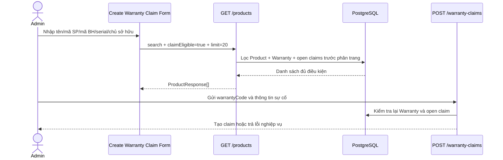

# Warranty Claim Eligible Product Search Implementation Plan

> **For agentic workers:** REQUIRED SUB-SKILL: Use superpowers:subagent-driven-development (recommended) or superpowers:executing-plans to implement this plan task-by-task. Steps use checkbox (`- [ ]`) syntax for tracking.

**Goal:** Chỉ hiển thị trong form tạo yêu cầu bảo hành các sản phẩm đang hoạt động, có bảo hành đang hiệu lực theo thời gian và chưa có yêu cầu bảo hành mở.

**Architecture:** Mở rộng API danh sách sản phẩm bằng query `claimEligible=true` để Prisma lọc điều kiện trước khi phân trang. Admin chỉ gửi query này và hiển thị nguyên danh sách API trả về; API tạo claim hiện tại tiếp tục là lớp kiểm tra cuối cùng nhằm xử lý dữ liệu cũ, request giả mạo và race condition.

**Tech Stack:** NestJS 11, Prisma 7, Next.js 16, React Query, TypeScript, Jest, Node test runner.

## Global Constraints

- Không dùng lại `activationEligible`; filter đó yêu cầu warranty `DRAFT`, ngược với luồng tạo claim cần warranty `ACTIVE`.
- Không thay đổi Prisma schema, migration hoặc dữ liệu seed.
- Không thay đổi business rule trong `CreateWarrantyClaimUseCase`.
- `claimEligible` chỉ tác động khi client truyền chính xác chuỗi `"true"`; các màn danh sách sản phẩm hiện có giữ nguyên kết quả.
- Điều kiện ngày dùng cùng một thời điểm `now` trong một lần dựng query.
- API vẫn kiểm tra lại điều kiện khi submit; dropdown hợp lệ không được xem là cơ chế bảo mật.
- Không commit nếu chưa được người dùng cho phép tại thời điểm triển khai.

---

## Phạm vi và quy tắc nghiệp vụ

Một sản phẩm được chọn để tạo yêu cầu bảo hành khi đồng thời thỏa mãn:

1. Product chưa bị soft-delete.
2. Product có trạng thái `ACTIVE`.
3. Có Warranty với mã bảo hành khác rỗng.
4. Warranty có trạng thái `ACTIVE`.
5. `start_date` để trống hoặc nhỏ hơn/bằng thời điểm hiện tại.
6. `end_date` để trống hoặc lớn hơn/bằng thời điểm hiện tại.
7. Không có WarrantyClaim ở một trong các trạng thái mở: `SUBMITTED`, `REVIEWING`, `APPROVED`, `IN_REPAIR`.

Không bắt buộc chủ sở hữu vì use case tạo claim hiện tại vẫn cho phép nhập thông tin người yêu cầu khi Product chưa có owner. Không loại claim đã `COMPLETED`, `REJECTED`, hoặc `CANCELLED`; các trạng thái này không ngăn tạo claim mới.

## Luồng dữ liệu



## Cấu trúc file

- `packages/shared/src/types/product.types.ts`: bổ sung query contract dùng chung `claimEligible`.
- `apps/api/src/modules/products/dto/list-products.dto.ts`: validate query HTTP là boolean string.
- `apps/api/src/modules/products/repository/products.repository.ts`: áp dụng Prisma eligibility filter trước count/findMany.
- `apps/api/src/modules/products/tests/list-products.dto.spec.ts`: test contract query.
- `apps/api/src/modules/products/tests/list-products.repository.spec.ts`: test chính xác Prisma where và pagination.
- `apps/admin/src/views/warranty-claims/warranty-claims.utils.ts`: tạo query thuần cho product selector.
- `apps/admin/src/views/warranty-claims/warranty-claims.utils.test.ts`: test query admin.
- `apps/admin/src/views/warranty-claims/hooks/use-create-warranty-claim-form.ts`: dùng query mới và bỏ frontend post-filter.

---

### Task 1: Thêm contract `claimEligible` và validation ở API

**Files:**

- Modify: `packages/shared/src/types/product.types.ts`
- Modify: `apps/api/src/modules/products/dto/list-products.dto.ts`
- Test: `apps/api/src/modules/products/tests/list-products.dto.spec.ts`

**Interfaces:**

- Produces: `ListProductsQuery.claimEligible?: "true" | "false"`.
- Produces: `ListProductsDto.claimEligible?: string`, được kiểm tra bởi `@IsBooleanString()`.

- [ ] **Step 1: Viết test fail cho DTO**

Thêm vào `apps/api/src/modules/products/tests/list-products.dto.spec.ts`:

```ts
it.each(["true", "false"])("accepts claimEligible=%s", async (value) => {
  const dto = plainToInstance(ListProductsDto, { claimEligible: value });

  await expect(validate(dto)).resolves.toHaveLength(0);
});

it("rejects a non-boolean claimEligible filter", async () => {
  const dto = plainToInstance(ListProductsDto, {
    claimEligible: "yes",
  });

  await expect(validate(dto)).resolves.not.toHaveLength(0);
});
```

- [ ] **Step 2: Chạy test để xác nhận fail**

Run:

```cmd
pnpm --filter @repo/shared build
pnpm --filter @repo/api run test -- --runInBand src/modules/products/tests/list-products.dto.spec.ts
```

Expected: test `claimEligible=yes` fail vì DTO chưa validate field này.

- [ ] **Step 3: Bổ sung shared query type và DTO**

Trong `ListProductsQuery` tại `packages/shared/src/types/product.types.ts` thêm:

```ts
claimEligible?: "true" | "false";
```

Trong `ListProductsDto` tại `apps/api/src/modules/products/dto/list-products.dto.ts` thêm ngay sau `activationEligible`:

```ts
@IsOptional()
@IsBooleanString()
claimEligible?: string;
```

- [ ] **Step 4: Chạy lại test DTO**

Run:

```cmd
pnpm --filter @repo/shared build
pnpm --filter @repo/api run test -- --runInBand src/modules/products/tests/list-products.dto.spec.ts
```

Expected: PASS toàn bộ test trong file.

- [ ] **Step 5: Review checkpoint**

Kiểm tra diff chỉ gồm contract và validation; chưa thay đổi kết quả API ở task này.

---

### Task 2: Lọc sản phẩm đủ điều kiện tạo claim trước khi phân trang

**Files:**

- Modify: `apps/api/src/modules/products/repository/products.repository.ts`
- Test: `apps/api/src/modules/products/tests/list-products.repository.spec.ts`

**Interfaces:**

- Consumes: `ListProductsDto.claimEligible` từ Task 1.
- Consumes: `WARRANTY_CLAIM_OPEN_STATUSES` từ `@repo/shared/constants`.
- Produces: `ProductsRepository.list({ claimEligible: 'true' })` chỉ trả Product đủ điều kiện tạo claim.

- [ ] **Step 1: Viết test fail cho Prisma eligibility filter**

Thêm test sau test `activationEligible` trong `list-products.repository.spec.ts`:

```ts
it("filters claim selectors to products with currently active warranties and no open claims", async () => {
  jest.useFakeTimers().setSystemTime(new Date("2026-08-27T08:00:00.000Z"));

  try {
    const findMany = jest.fn().mockResolvedValue([]);
    const count = jest.fn().mockResolvedValue(0);
    const prismaService = {
      $transaction: jest.fn((callback: (tx: unknown) => unknown) =>
        callback({ product: { count, findMany } }),
      ),
    };
    const repository = new ProductsRepository(prismaService as never);

    await repository.list({
      claimEligible: "true",
      limit: 20,
      page: 1,
      search: "WM-2026",
    });

    const now = new Date("2026-08-27T08:00:00.000Z");
    const expectedEligibility = {
      deleted_at: null,
      status: product_status.ACTIVE,
      warranty: {
        is: {
          status: warranty_status.ACTIVE,
          warranty_code: { not: "" },
          AND: [
            { OR: [{ start_date: null }, { start_date: { lte: now } }] },
            { OR: [{ end_date: null }, { end_date: { gte: now } }] },
          ],
          claims: {
            none: {
              status: {
                in: ["SUBMITTED", "REVIEWING", "APPROVED", "IN_REPAIR"],
              },
            },
          },
        },
      },
    };

    expect(findMany).toHaveBeenCalledWith(
      expect.objectContaining({
        where: expect.objectContaining({
          ...expectedEligibility,
          OR: expect.any(Array),
        }),
        skip: 0,
        take: 20,
      }),
    );
    expect(count).toHaveBeenCalledWith({
      where: expect.objectContaining(expectedEligibility),
    });
  } finally {
    jest.useRealTimers();
  }
});
```

Nếu Prisma enum bắt buộc trong assertion, import thêm `warranty_claim_status` và thay các chuỗi bằng enum tương ứng. Implementation vẫn phải lấy danh sách trạng thái từ `WARRANTY_CLAIM_OPEN_STATUSES`, không tạo constant thứ hai.

- [ ] **Step 2: Chạy repository test để xác nhận fail**

Run:

```cmd
pnpm --filter @repo/shared build
pnpm --filter @repo/api run test -- --runInBand src/modules/products/tests/list-products.repository.spec.ts
```

Expected: FAIL vì `ProductsRepository.list` chưa nhận hoặc chưa áp dụng `claimEligible`.

- [ ] **Step 3: Mở rộng repository input và dựng filter**

Thêm import:

```ts
import { WARRANTY_CLAIM_OPEN_STATUSES } from "@repo/shared/constants";
```

Thêm vào kiểu tham số của `list`:

```ts
claimEligible?: string;
```

Tạo cờ cùng với `activationEligible`:

```ts
const activationEligible = filters.activationEligible === "true";
const claimEligible = filters.claimEligible === "true";
const now = new Date();
```

Điều chỉnh các nhánh `deleted_at`, `status`, và `warranty` trong `where`:

```ts
deleted_at:
  activationEligible || claimEligible
    ? null
    : buildProductDeletionFilter(filters.status),
status:
  activationEligible || claimEligible
    ? product_status.ACTIVE
    : filters.status,
warranty: claimEligible
  ? {
      is: {
        status: warranty_status.ACTIVE,
        warranty_code: { not: '' },
        AND: [
          { OR: [{ start_date: null }, { start_date: { lte: now } }] },
          { OR: [{ end_date: null }, { end_date: { gte: now } }] },
        ],
        claims: {
          none: {
            status: { in: [...WARRANTY_CLAIM_OPEN_STATUSES] },
          },
        },
      },
    }
  : activationEligible
    ? {
        is: {
          status: warranty_status.DRAFT,
          warranty_code: { not: '' },
        },
      }
    : filters.warrantyStatus
      ? { status: filters.warrantyStatus }
      : undefined,
```

Giữ nguyên hai relation `warranty_activation_request_items` và `warranty_activation_requests`: chúng chỉ áp dụng cho `activationEligible`, không áp dụng cho claim.

- [ ] **Step 4: Chạy targeted repository test**

Run:

```cmd
pnpm --filter @repo/shared build
pnpm --filter @repo/api run test -- --runInBand src/modules/products/tests/list-products.repository.spec.ts
```

Expected: PASS, bao gồm cả test activation eligibility cũ để chứng minh hai flow không ảnh hưởng nhau.

- [ ] **Step 5: Chạy cả DTO và repository tests**

Run:

```cmd
pnpm --filter @repo/shared build
pnpm --filter @repo/api run test -- --runInBand src/modules/products/tests/list-products.dto.spec.ts src/modules/products/tests/list-products.repository.spec.ts
```

Expected: PASS toàn bộ.

- [ ] **Step 6: Review checkpoint**

Xác nhận `claimEligible=false` hoặc không truyền field không làm thay đổi query cũ. Không thêm điều kiện owner, category hoặc activation request vào claim filter.

---

### Task 3: Chuyển form admin sang server-side claim eligibility

**Files:**

- Modify: `apps/admin/src/views/warranty-claims/warranty-claims.utils.ts`
- Test: `apps/admin/src/views/warranty-claims/warranty-claims.utils.test.ts`
- Modify: `apps/admin/src/views/warranty-claims/hooks/use-create-warranty-claim-form.ts`

**Interfaces:**

- Consumes: `ListProductsQuery.claimEligible` từ Task 1.
- Produces: `buildWarrantyClaimProductQuery(search: string): ListProductsQuery`.
- Behavior: selector không còn `.filter(product.warrantyCode !== null)` sau phân trang.

- [ ] **Step 1: Viết test fail cho query helper**

Thêm `buildWarrantyClaimProductQuery` vào import của `warranty-claims.utils.test.ts`, rồi thêm:

```ts
test("claim product selector requests only claim-eligible products", () => {
  assert.deepEqual(buildWarrantyClaimProductQuery("  WM-2026-ABC  "), {
    claimEligible: "true",
    limit: 20,
    search: "WM-2026-ABC",
    sortBy: "createdAt",
    sortOrder: "desc",
  });

  assert.deepEqual(buildWarrantyClaimProductQuery("   "), {
    claimEligible: "true",
    limit: 20,
    search: undefined,
    sortBy: "createdAt",
    sortOrder: "desc",
  });
});
```

- [ ] **Step 2: Chạy test để xác nhận fail**

Run:

```cmd
pnpm --filter @repo/admin exec node --import tsx --test src/views/warranty-claims/warranty-claims.utils.test.ts
```

Expected: FAIL vì helper chưa tồn tại.

- [ ] **Step 3: Viết query helper thuần**

Thêm `ListProductsQuery` vào import type từ `@repo/shared`, sau đó thêm vào `warranty-claims.utils.ts`:

```ts
export function buildWarrantyClaimProductQuery(
  search: string,
): ListProductsQuery {
  const normalizedSearch = search.trim();

  return {
    claimEligible: "true",
    limit: 20,
    search: normalizedSearch || undefined,
    sortBy: "createdAt",
    sortOrder: "desc",
  };
}
```

- [ ] **Step 4: Chạy helper test để xác nhận pass**

Run:

```cmd
pnpm --filter @repo/admin exec node --import tsx --test src/views/warranty-claims/warranty-claims.utils.test.ts
```

Expected: PASS toàn bộ test trong file.

- [ ] **Step 5: Dùng helper trong form hook**

Trong `use-create-warranty-claim-form.ts`:

1. Bỏ `useMemo` khỏi import React.
2. Import `buildWarrantyClaimProductQuery`.
3. Thay query và post-filter bằng:

```ts
const productsQuery = useProducts(
  buildWarrantyClaimProductQuery(debouncedProductSearch),
);
const products = productsQuery.data?.items ?? [];
```

Giữ guard trong `selectProduct`:

```ts
if (!product.warrantyCode) return;
```

Guard này phòng response cũ hoặc cache cũ; nó không thay thế backend filter.

- [ ] **Step 6: Chạy toàn bộ admin tests**

Run:

```cmd
pnpm --filter @repo/admin test
```

Expected: PASS toàn bộ admin tests.

- [ ] **Step 7: Review checkpoint**

Xác nhận frontend không còn lọc sau pagination. Khi API trả 20 sản phẩm thì selector có thể hiển thị đủ 20 sản phẩm hợp lệ.

---

### Task 4: Verification toàn luồng và kiểm tra race condition

**Files:**

- No production file changes expected.
- Modify tests only if verification phát hiện regression có thể tái hiện ổn định.

**Interfaces:**

- Verifies: `GET /products?claimEligible=true` và `POST /warranty-claims` thống nhất rule nhưng vẫn độc lập về kiểm tra an toàn.

- [ ] **Step 1: Chạy typecheck các package bị ảnh hưởng**

Run:

```cmd
pnpm --filter @repo/shared build
pnpm --filter @repo/api check-types
pnpm --filter @repo/admin check-types
```

Expected: cả ba lệnh exit code 0.

- [ ] **Step 2: Chạy lint các package bị ảnh hưởng**

Run:

```cmd
pnpm --filter @repo/api lint
pnpm --filter @repo/admin lint
```

Expected: exit code 0; admin không có warning vì dùng `--max-warnings 0`.

- [ ] **Step 3: Chạy targeted backend và frontend tests lần cuối**

Run:

```cmd
pnpm --filter @repo/shared build
pnpm --filter @repo/api run test -- --runInBand src/modules/products/tests/list-products.dto.spec.ts src/modules/products/tests/list-products.repository.spec.ts src/modules/warranty-claims/tests/create-warranty-claim.use-case.spec.ts
pnpm --filter @repo/admin exec node --import tsx --test src/views/warranty-claims/warranty-claims.utils.test.ts
```

Expected: PASS toàn bộ.

- [ ] **Step 4: Test thủ công selector**

Tại `/vi/warranty-claims/create`, tìm lần lượt bằng tên sản phẩm, mã sản phẩm, mã bảo hành, serial và tên chủ sở hữu. Xác nhận:

- Product `ACTIVE` + Warranty `ACTIVE` trong thời gian hiệu lực + không có open claim: xuất hiện.
- Warranty `DRAFT`, `EXPIRED`, `VOIDED`: không xuất hiện.
- Warranty `ACTIVE` nhưng `start_date` ở tương lai: không xuất hiện.
- Warranty `ACTIVE` nhưng `end_date` đã qua: không xuất hiện.
- Product có claim `SUBMITTED`, `REVIEWING`, `APPROVED`, hoặc `IN_REPAIR`: không xuất hiện.
- Product chỉ có claim `COMPLETED`, `REJECTED`, hoặc `CANCELLED`: vẫn xuất hiện.
- Product bị xóa mềm hoặc Product không `ACTIVE`: không xuất hiện.

- [ ] **Step 5: Test stale/race behavior**

Mở form ở hai tab với cùng Product đủ điều kiện. Tạo claim thành công ở tab thứ nhất, sau đó submit tab thứ hai. Expected: tab thứ hai nhận lỗi open claim từ `CreateWarrantyClaimUseCase`; không tạo claim trùng.

- [ ] **Step 6: Kiểm tra diff cuối**

Run:

```cmd
git status --short
git diff --check
git diff -- packages/shared/src/types/product.types.ts apps/api/src/modules/products apps/admin/src/views/warranty-claims
```

Expected: không có whitespace error; không có migration, seed, PDF, email hoặc UI ngoài claim selector trong diff.

## Kết quả UX sau triển khai

- Người dùng tìm kiếm như cũ, không thêm bước và không phải hiểu trạng thái nội bộ.
- Dropdown không hiển thị sản phẩm chắc chắn bị backend từ chối.
- Kết quả không bị thiếu do frontend lấy 20 sản phẩm rồi mới loại bớt.
- Nếu trạng thái thay đổi sau lúc chọn, submit vẫn bị backend từ chối đúng nghiệp vụ.
- Không cần thêm message i18n vì giao diện và error contract không đổi.

## Ảnh hưởng business logic

- Không thay đổi điều kiện tạo claim; chỉ đưa cùng điều kiện đó lên query đọc để cải thiện selector.
- Không thay đổi cách tạo, cập nhật hoặc đóng claim.
- Không thay đổi Product, Warranty hoặc WarrantyClaim domain model.
- Không tạo hoặc sửa dữ liệu khi chỉ mở/tìm kiếm dropdown.
- Không ảnh hưởng selector kích hoạt bảo hành điện tử vì selector đó tiếp tục dùng `activationEligible=true`.
