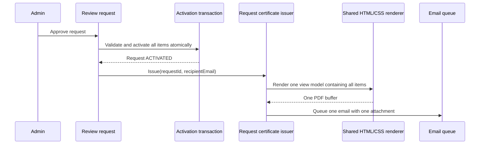

# Request-Owned Activation Certificate Design

**Status:** Approved for implementation on 2026-08-20.

## Goal

Every `WarrantyActivationRequest` owns exactly one electronic certificate, one
PDF file, and at most one initial email. This rule is independent of whether the
request contains one or many physical products.

Each request item keeps its own Product, Warranty, and `WM-...` warranty code.
Public lookup by a `WM-...` code continues to return only that Product.

## Scope

- Add `WarrantyActivationRequestCertificate` as a one-to-one child of
  `WarrantyActivationRequest`.
- Issue one request certificate after the activation transaction commits.
- Reuse the existing static HTML/CSS template and Chromium renderer.
- Build one view model containing all request products and positions.
- Store one PDF, queue one email attachment, and expose one request-level set of
  view/download/resend actions.
- Keep `WarrantyCertificate` for direct/manual Warranty activation flows that
  do not originate from an activation request.

## Business Rules

1. A request with at least one activated item can issue one request certificate.
2. `activation_request_id` is unique; retries reuse the same record.
3. A generated certificate is idempotent and is not rendered or uploaded again.
4. PDF/email work happens after Warranty activation commits. Integration failure
   never rolls back activated Warranties.
5. Generation failure is persisted with `FAILED` and `last_error` for retry.
6. Request routes never fall back to a Product-owned certificate.
7. Request item rows expose Warranty identity, but no certificate actions.
8. Direct/manual activation continues using Product-owned certificates.

## Domain Model

```text
WarrantyActivationRequest 1 --- 0..1 WarrantyActivationRequestCertificate
WarrantyActivationRequest 1 --- 1..N WarrantyActivationRequestItem
WarrantyActivationRequestItem N --- 1 Warranty
Warranty 1 --- 0..N WarrantyCertificate
```

The request certificate stores its number, PDF storage key, generation status,
recipient, email status, timestamps, error, version, and audit metadata.

## Architecture

- A request-certificate repository owns all Prisma access for this aggregate.
- The issuing use case loads a request snapshot, creates/reuses the certificate,
  builds the shared `WarrantyCertificateViewModel`, renders through
  `WarrantyCertificatePdfService`, uploads once, and queues one email.
- `WarrantyCertificatePdfService` remains the single facade over the static
  HTML template and Chromium renderer. Product and request flows only differ in
  how they build the view model.
- The email worker updates either Product-certificate or request-certificate
  delivery state based on an explicit job field.

## Lifecycle



## API and UX

Canonical request routes:

```text
GET  /warranty-activation-requests/:id/certificate/view
GET  /warranty-activation-requests/:id/certificate/download
POST /warranty-activation-requests/:id/certificate/resend-email
```

Item-level certificate routes and Admin handlers are removed from the activation
request flow. Admin detail displays one certificate summary and one action group.

## Non-goals

- Removing Product-owned `WarrantyCertificate`.
- Merging item `WM-...` codes into the aggregate `CERT-...` number.
- Returning sibling products from public Warranty lookup.
- Creating a template registry or per-category visual templates.
- Changing Product selection, activation eligibility, or Warranty duration.

## Acceptance Criteria

1. One-item and multi-item requests both create one request certificate.
2. Neither request shape creates Product certificates for its items.
3. One PDF contains every item and can paginate automatically.
4. One initial email contains one PDF attachment and every item summary.
5. Repeated issuance does not create another record, upload, or initial email.
6. PDF/email failures do not roll back activated Warranties.
7. Request view/download/resend use only the request certificate.
8. Direct/manual activation Product certificates still work.
9. API/Admin tests, typechecks, lint, and relevant builds pass.
